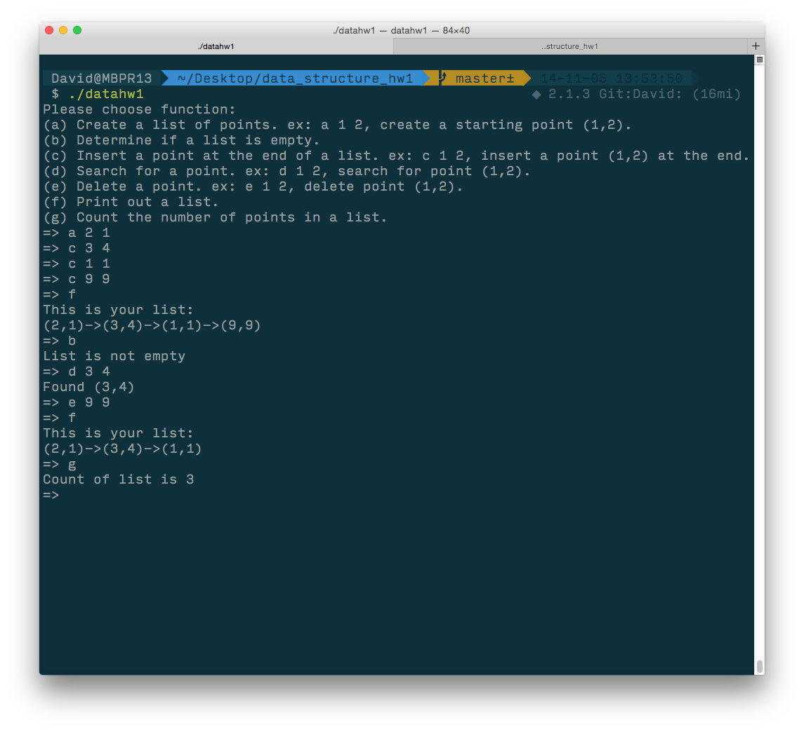

#Data Structure HW 1
##Linked list of two-dimensional points

##This is hw 1 of data structure.

###Question
For a linked list of two-dimensional points (i.e. (x, y)) create a user-friendly, menu-driven program
that performs the following operations. Please discuss the complexity for each operation.
###requirment
(a) Create a list of points.

(b) Determine if a list is empty.

(c) Insert a point at the end of a list.

(d) Search for a point.

(e) Delete a point.

(f) Print out a list.

(g) Count the number of points in a list.

##Build
	gcc datastructurehw1.c -o datahw1
##Run
	./datahw1
##Instruction of each function 
	(a) Create a list of points. ex: a 1 2, create a starting point (1,2).
	(b) Determine if a list is empty.
	(c) Insert a point at the end of a list. ex: c 1 2, insert a point (1,2) at the end.
	(d) Search for a point. ex: d 1 2, search for point (1,2).
	(e) Delete a point. ex: e 1 2, delete point (1,2).
	(f) Print out a list.
	(g) Count the number of points in a list.